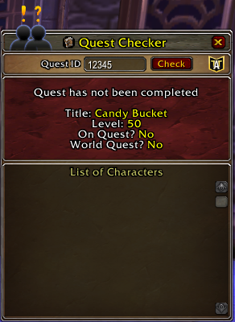
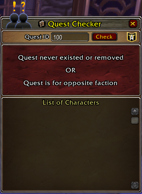
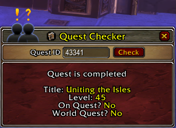

# Quest Checker
'Quest Checker' is a World of Warcraft addon designed to check if you have/have not completed the quest'.  Bonus:  If you have ATT installed, you can see if you have completed it on another toon or not :)

## About Me
I'm Vandiel, in ATT on Discord (Vandiel#2276) and on Korgath.  I'm by no means a expert programmer/coder, but like to learn and experiment things.  I'm always happy to have some insight and/or improvement to the code.

## Contribute
Please report bugs on the [Github Issue Reporting] https://github.com/vandiel01/QuestChecker/issues/new.

The use of [BugGrabber] https://www.curseforge.com/wow/addons/bug-grabber and [BugSack] https://www.curseforge.com/wow/addons/bugsack will help tremendously with the debugging process.

You can also contribute to the addon by [Donate] https://paypal.me/Vandiel01

## Use
/qc to use 

## Image Samples
###### Normal Frame w/ AllTheThings Installed
 
###### Normal Frame w/ AllTheThings Installed
 
###### Normal Frame w/ AllTheThings Installed
 
###### Normal Frame w/o AllTheThings
 
